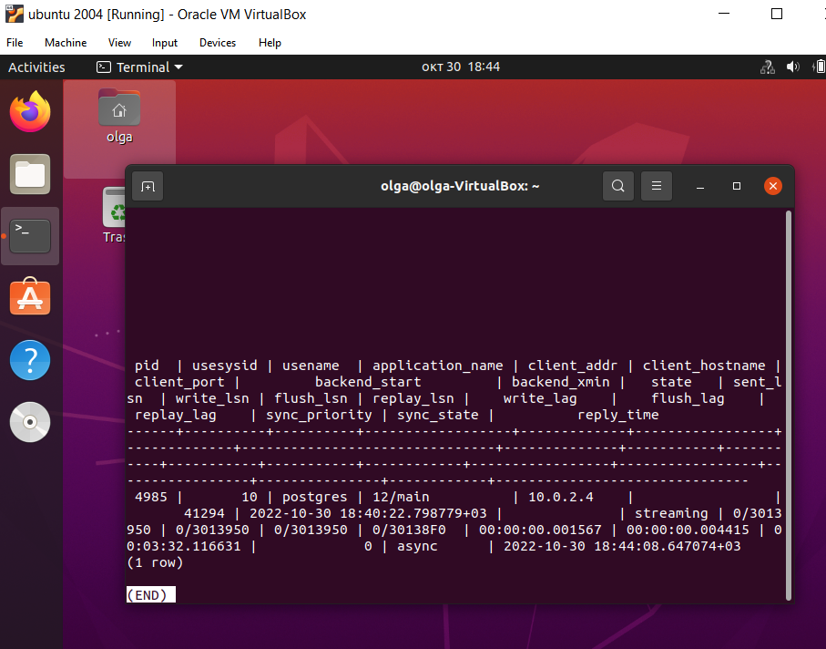

# Домашнее задание по лекции 18

## Репликация

**1. Физическая репликация**

Настроить физическую репликации между двумя кластерами базы данных

1. Репликация должна работать использую "слот репликации"

Создаем слот репликации на мастере:

Настраиваем слот репликации на реплике

Слот репликации активен на мастере

2. Реплика должна отставать от мастера на 5 минут

3. Проверяем репликацию

Добавим запись 110 на мастере:

Проверяем, что запись не появилась на реплике, т.к. настроено отставание на 5 мин.:

Через 5 мин значение появилось на реплике:

Настройки репликации на основном сервере:

**2. Логическая репликация**

Создать на первом кластере базу данных, таблицу и наполнить ее данными (на ваше усмотрение)

На нем же создать публикацию этой таблицы

На новом кластере подписаться на эту публикацию

Убедиться что она среплицировалась. 

Добавляем запись в таблицу на основном сервере:

Запись появилась на логической реплике
