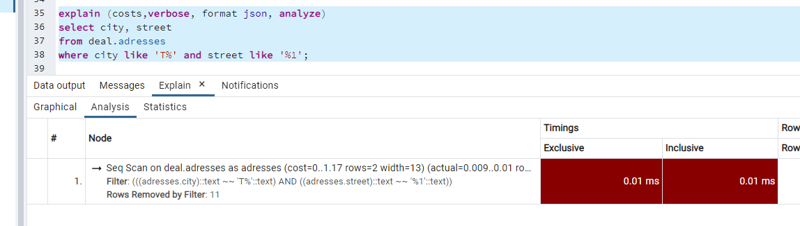

# Домашнее задание по лекции 2

## Компоненты современной СУБД

1. Проводим анализ возможных запросов\отчетов\поиска данных.

2. Предполагаем возможную кардинальность поля.

3. Создаем дополнительные индексы - простые или композитные.

5. На каждый индекс пишем краткое описание зачем он нужен (почему по этому полю\полям).

7. Думаем какие логические ограничения в БД нужно добавить - например какие поля должны быть уникальны, в какие нужно добавить условия, чтобы не нарушить бизнес логику. Пример - нельзя провести операцию по переводу средств на отрицательную сумму.
**Для поля "Номер телефона" зашиваем маску, по которой должно выполняться заполнение.** 

6.Создаем ограничения по выбранным полям.

Индексы

