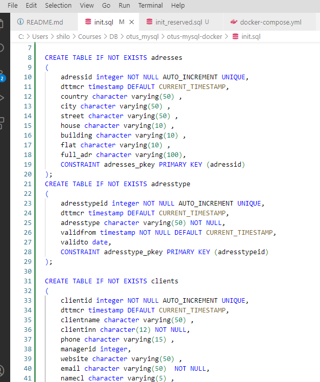
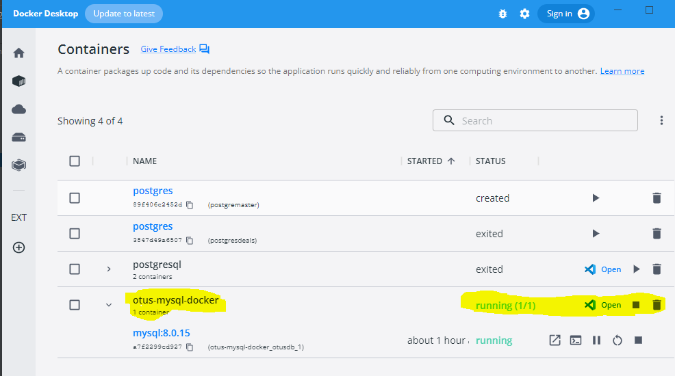
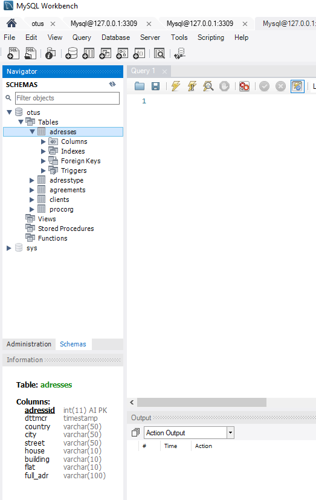
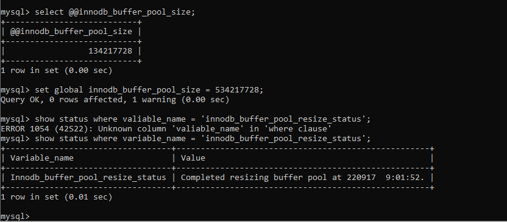

# Домашнее задание по лекции 21

## Внутренняя структура СУБД MySQL

1. забрать стартовый репозиторий https://github.com/aeuge/otus-mysql-docker

2. прописать sql скрипт для создания своей БД в init.sql

4. проверить запуск и работу контейнера следую описанию в репозитории

4. прописать кастомный конфиг - настроить innodb_buffer_pool и другие параметры по желанию

