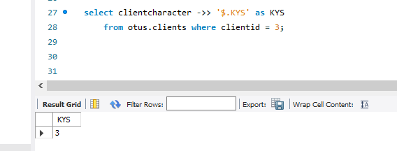

# Домашнее задание по лекции 22

## Типы данных в MySQL

1. проанализировать типы данных в своем проекте, изменить при необходимости. В README указать что на что поменялось и почему.

1.1.

Было: adresstypeid integer NOT NULL GENERATED ALWAYS AS IDENTITY ( INCREMENT 1 START 1 MINVALUE 1 MAXVALUE 2147483647 CACHE 1 )

Стало: adresstypeid integer NOT NULL AUTO_INCREMENT UNIQUE

1.2.

Было: dttmcr timestamp with time zone NOT NULL DEFAULT now()

Стало: dttmcr timestamp DEFAULT CURRENT_TIMESTAMP

1.3. 
Было: numeric(6,2)

Стало: float(6,2)

2. добавить тип JSON в структуру. Проанализировать какие данные могли бы там хранится. привести примеры SQL для добавления записей и выборки.

В качестве данных с типом JSON можно хранить характеристики клиента, которые не часто используются, но могут быть полезными для проверки клиента перед заключением сделки.

Добавлен тип JSON и добавлены значения:

Примеры выборки данных:

2.1.

2.2.

