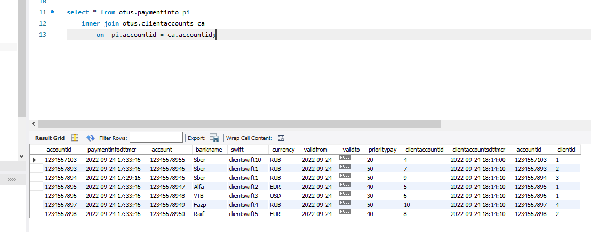
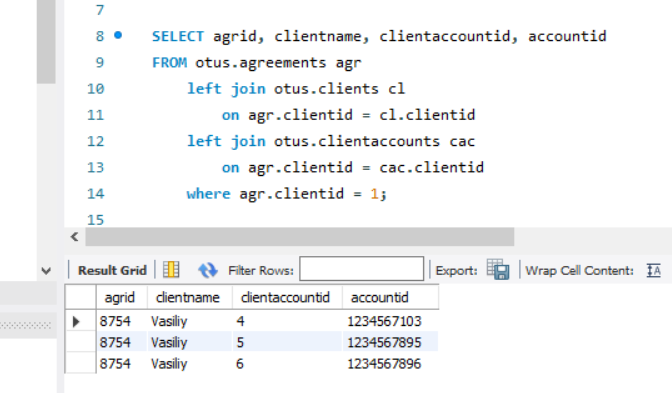
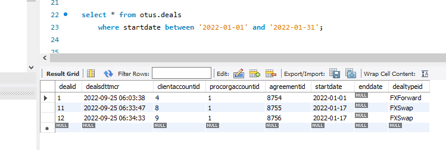
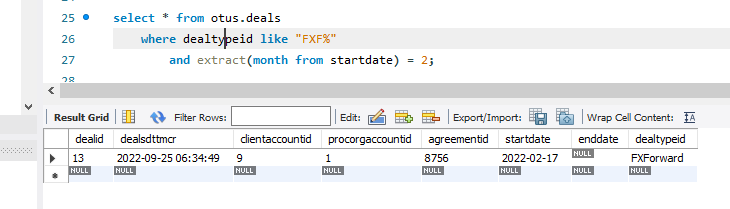
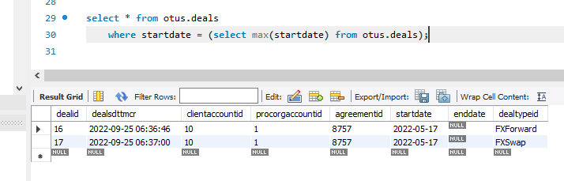
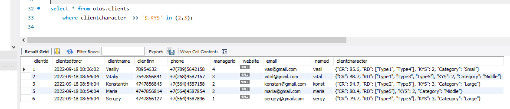
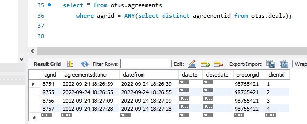

# Домашнее задание по лекции 24

## DML: вставка, обновление, удаление, выборка данных

1. Напишите запрос по своей базе с inner join

Из таблицы счетов выведем только те счета, которые относятся к клиентам.
Счета организации не войдут в список.

2. Напишите запрос по своей базе с left join

Есть таблица договоров с клиентами, есть таблица клиентов с id их счетов, есть общая таблица счетов
Требуется вывести счета клиента 1 по всем договорам.

3. Напишите 5 запросов с WHERE с использованием разных
операторов, опишите для чего вам в проекте нужна такая выборка данных

3.1. Вывести все сделки, заключенные в январе 2022 года.

3.2. Вывести все сделки, наименование которых начинается на FXF.. и заключенные в феврале.

3.3. Вывести все сделки, заключенные в наиболее свежую дату.

3.4. Вывести клиентов, у которых параметр KYS либо 2, либо 3.

3.5. Вывести договора, которые участвуют в фактических сделках с клиентами.
