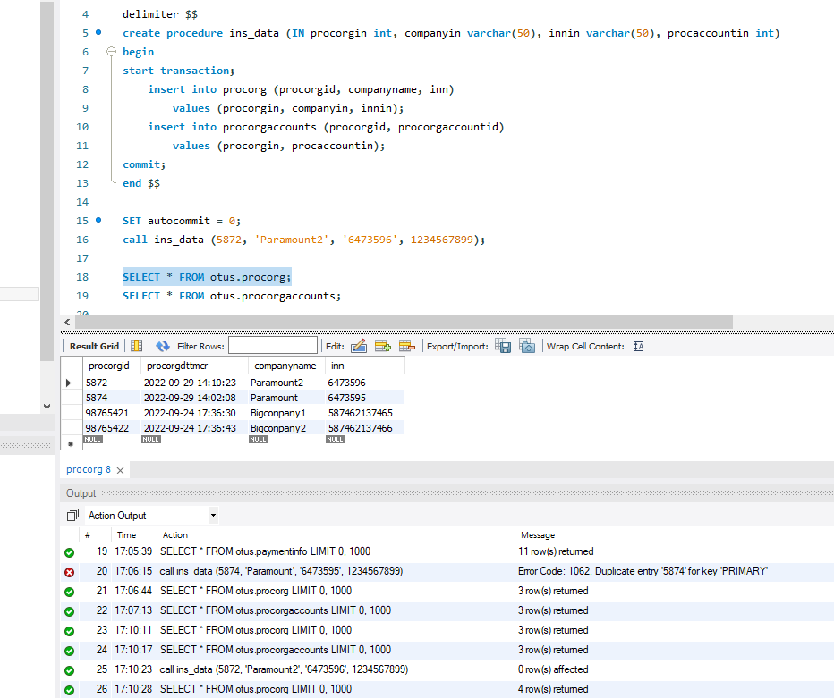
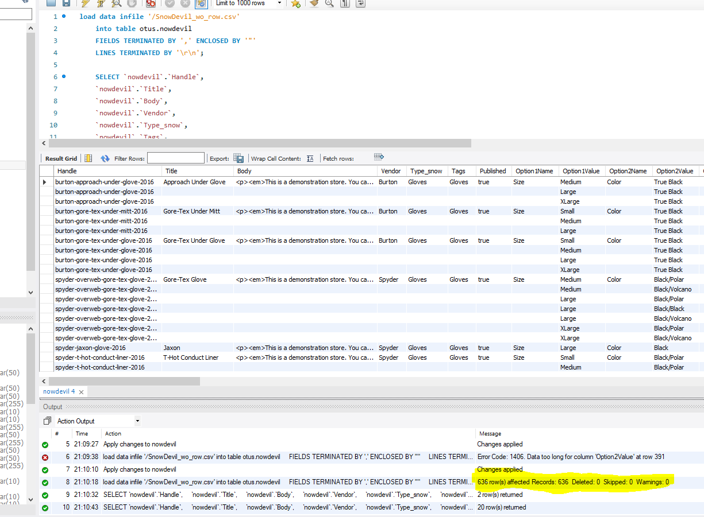

# Домашнее задание по лекции 25

## Транзакции, MVCC, ACID 

1. Описать пример транзакции из своего проекта с изменением данных в нескольких таблицах. Реализовать в виде хранимой процедуры.

Написана процедура, которая вносит переданные данные в 2 таблицы.
Внутри процедуры отрабатывает транзакция.
До выполнения процедуры автокоммит был отключен.

2. Загрузить данные из приложенных в материалах csv.
Реализовать следующими путями:
LOAD DATA
mysqlimport

Загрузила с помощью load data:
