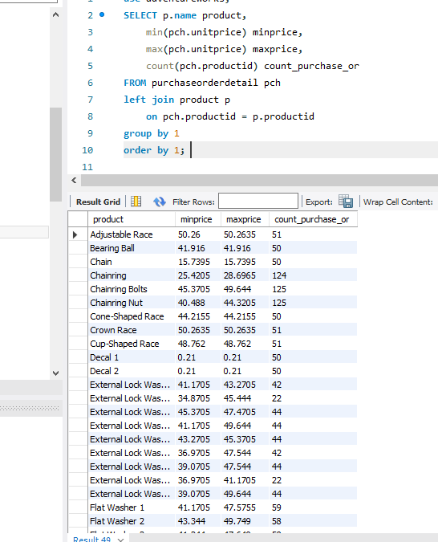
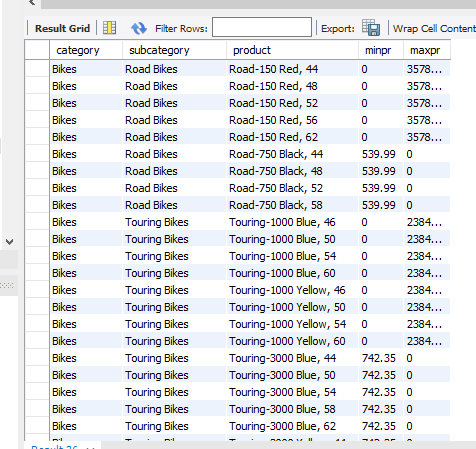
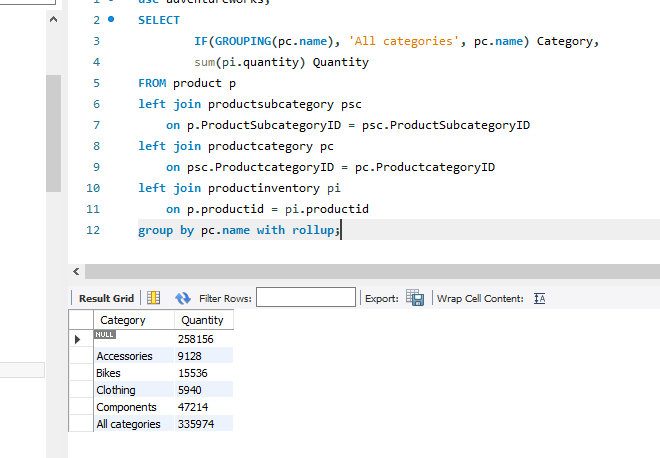

# Домашнее задание по лекции 26

## DML: агрегация и сортировка 

1. Для магазина к предыдущему списку продуктов добавить максимальную и минимальную цену и кол-во предложений



2. Также сделать выборку показывающую самый дорогой и самый дешевый товар в каждой категории

```
select  pc.name,
		psc.name,
        p.name,
        case when p.listprice = gr.minprice then p.listprice else '0' end as minpr,
        case when p.listprice = gr.maxprice then p.listprice else '0' end as maxpr
from product p
left join productsubcategory psc
	on p.ProductSubcategoryID = psc.ProductSubcategoryID
left join productcategory pc
	on psc.ProductcategoryID = pc.ProductcategoryID
inner join (
SELECT  pc.name category,
        psc.name subcategory,
        min(p.listprice) minprice,
        max(p.listprice) maxprice
FROM product p
left join productsubcategory psc
	on p.ProductSubcategoryID = psc.ProductSubcategoryID
left join productcategory pc
	on psc.ProductcategoryID = pc.ProductcategoryID
group by pc.name, psc.name
) gr
on pc.name = gr.category and psc.name = gr.subcategory and (p.listprice = gr.minprice or p.listprice = gr.maxprice)
order by pc.name,
         psc.name,
         p.name;
```



3. Сделать rollup с количеством товаров по категориям

