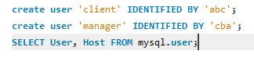
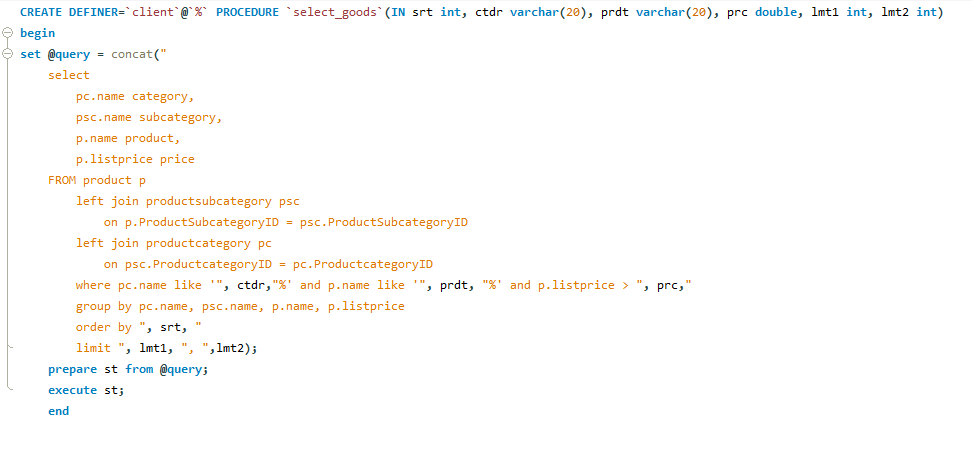
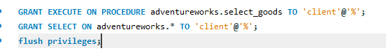
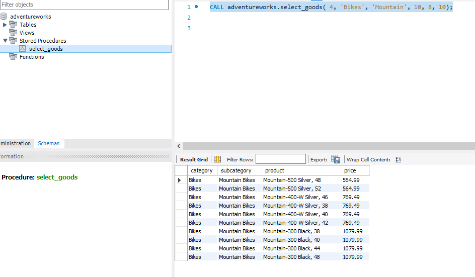
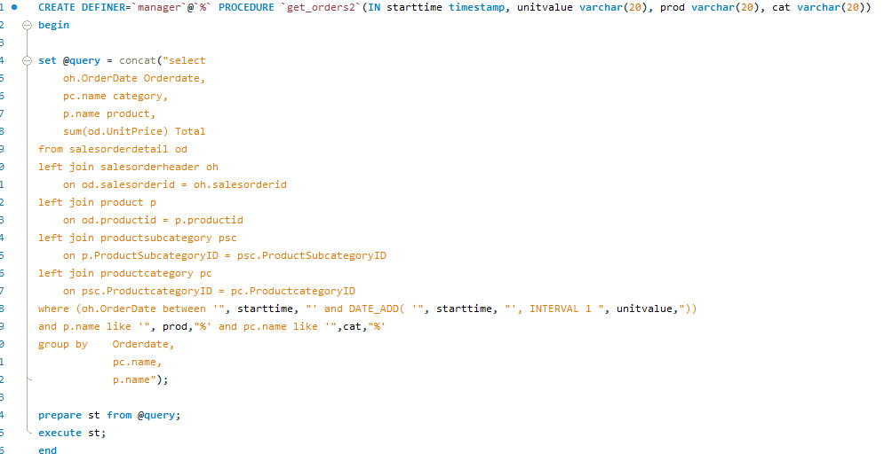
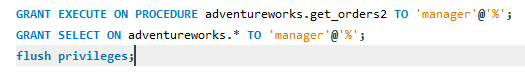
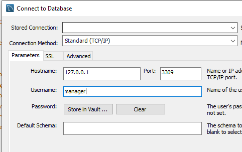
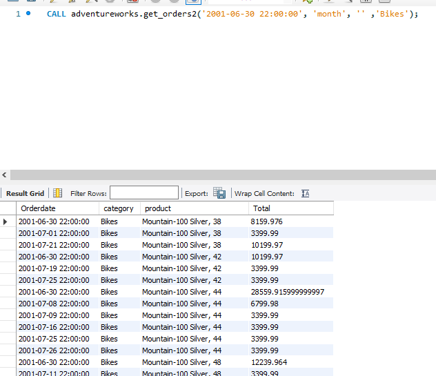

# Домашнее задание по лекции 29

## Транзакции, MVCC, ACID 

1. Создать пользователей client, manager.

2. Создать процедуру выборки товаров с использованием различных фильтров: категория, цена, производитель, различные дополнительные параметры
Также в качестве параметров передавать по какому полю сортировать выборку, и параметры постраничной выдачи

3. дать права да запуск процедуры пользователю client

4. Создать процедуру get_orders - которая позволяет просматривать отчет по продажам за определенный период (час, день, неделя)
с различными уровнями группировки (по товару, по категории, по производителю)

5. Права дать пользователю manager

