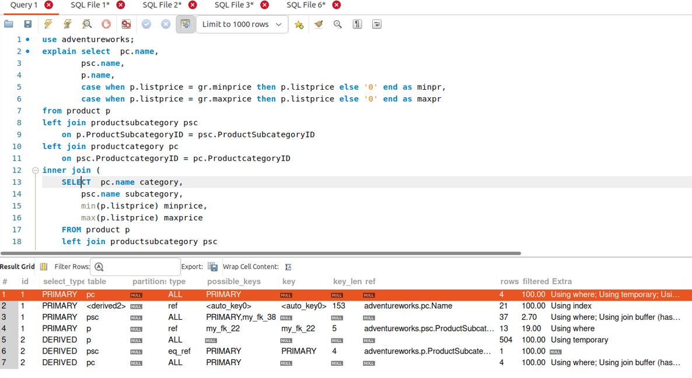
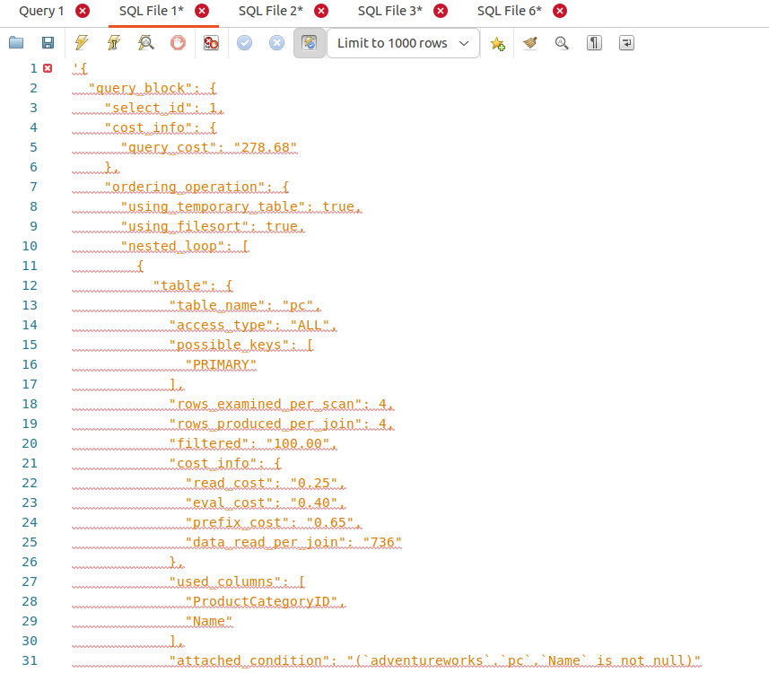
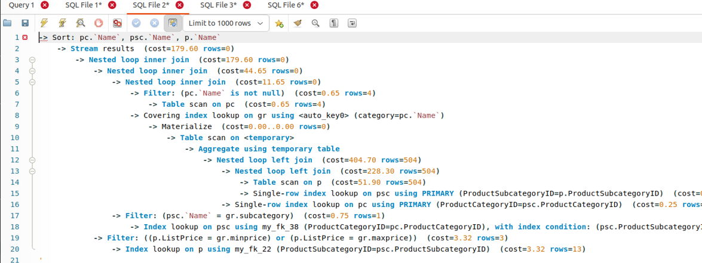
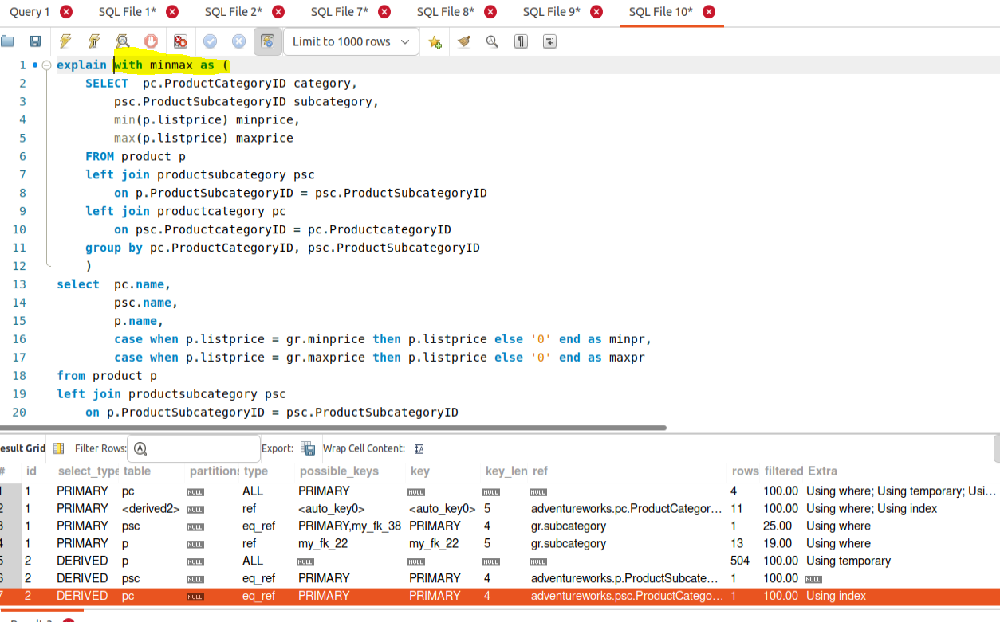
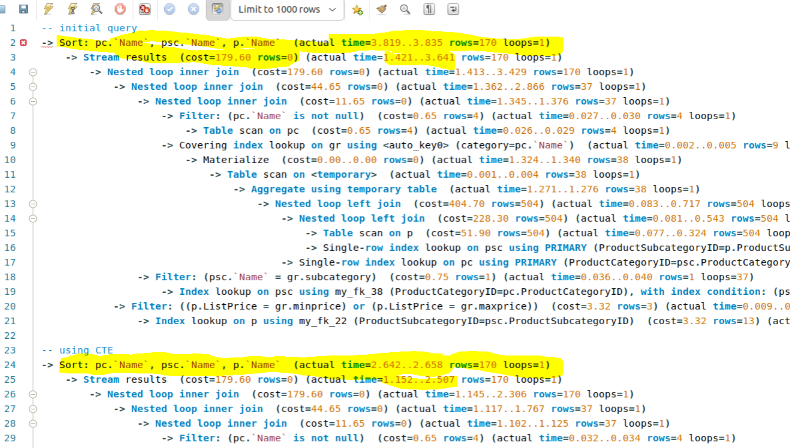

# Домашнее задание по лекции 32

## Оптимизация производительности. Профилирование. Мониторинг 

возьмите сложную выборку из предыдущих ДЗ с несколькими join и подзапросами
постройте EXPLAIN в 3 формата
оцените план прохождения запроса, найдите самые тяжелые места
попробуйте оптимизировать запрос (можно использовать индексы, хинты, сбор статистики, гистограммы)
все действия и результаты опишите в README.md

Взяла выборку из другого ДЗ:
```
select  pc.name,
		psc.name,
        p.name,
        case when p.listprice = gr.minprice then p.listprice else '0' end as minpr,
        case when p.listprice = gr.maxprice then p.listprice else '0' end as maxpr
from product p
left join productsubcategory psc
	on p.ProductSubcategoryID = psc.ProductSubcategoryID
left join productcategory pc
	on psc.ProductcategoryID = pc.ProductcategoryID
inner join (
    SELECT  pc.name category,
        psc.name subcategory,
        min(p.listprice) minprice,
        max(p.listprice) maxprice
    FROM product p
    left join productsubcategory psc
	    on p.ProductSubcategoryID = psc.ProductSubcategoryID
    left join productcategory pc
	    on psc.ProductcategoryID = pc.ProductcategoryID
    group by pc.name, psc.name
    ) gr
on pc.name = gr.category and psc.name = gr.subcategory and (p.listprice = gr.minprice or p.listprice = gr.maxprice)
order by pc.name,
         psc.name,
         p.name;
```
1. Explain. Формат 1.



2. Explain. Формат 2.



3. Explain. Формат 3.



4. Переписала запрос с использованием CTE.



Скорость запроса увеличилась.




По-другому оптимизировать запрос не удается.