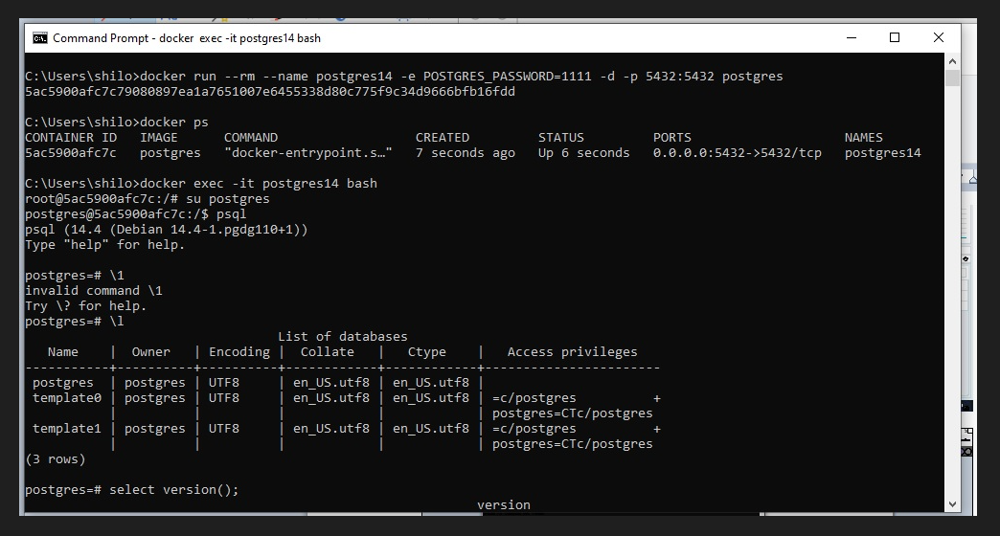
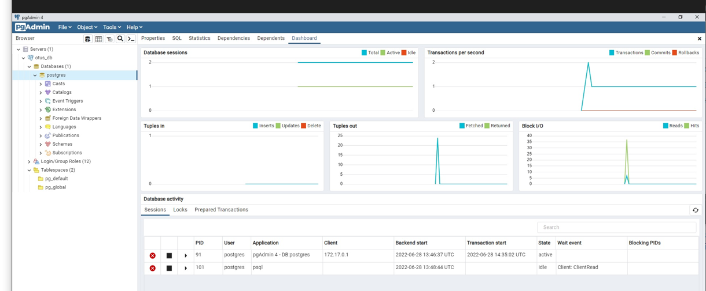

# Домашнее задание по лекции 6

## Внутренняя структура СУБД POSTGRESQL

Развернуть контейнер с PostgreSQL, запустить сервер, создать клиента с подключением через командную строку:

Подключиться к серверу через PgAdmin

