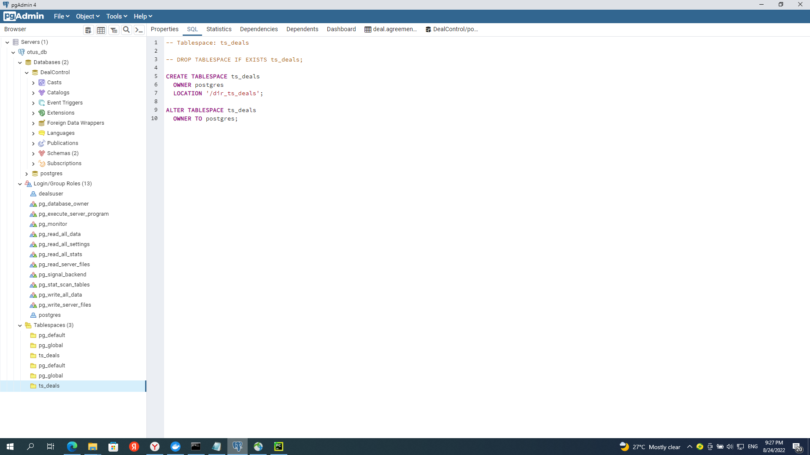
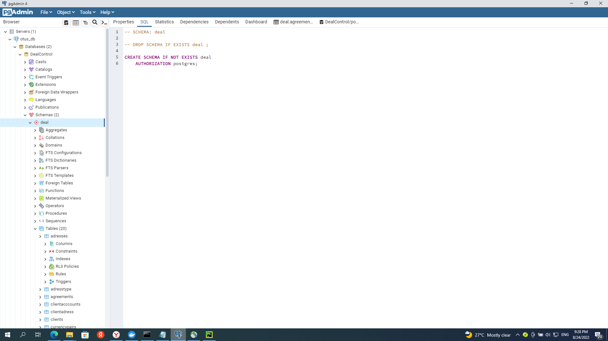

# Домашнее задание по лекции 7

## DDL СУБД POSTGRESQL

Используя операторы DDL создайте на примере схемы интернет-магазина:

Базу данных.

Табличные пространства и роли.

Схему данных.

Таблицы своего проекта, распределив их по схемам и
табличным пространствам.

