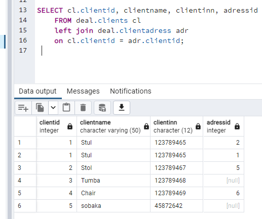

# Домашнее задание по лекции 9

## DML СУБД POSTGRESQL

1. Напишите запрос по своей базе с регулярным выражением, добавьте пояснение, что вы хотите найти.

Ищем всех клиентов с буквы s или S, т.е. независимо от регистра.

2. Напишите запрос по своей базе с использованием LEFT JOIN и INNER JOIN, как порядок соединений в FROM влияет на результат? Почему?
Таблица клиентов

Таблица адресов клиентов

Inner Join. Выборка только пересекающихся записей

Left Join. Вывод всех значений из левой таблицы, и тех значений, которые есть в правой. Если соответствие в правой таблице не найдено, то данные из левой таблицы выводятся, а вместо данных из правой таблицы подставляется null.

3.Напишите запрос на добавление данных с выводом информации о добавленных строках.

4. Напишите запрос с обновлением данные используя UPDATE FROM.

Добавляем имя клиента из другой таблицы.

6. Напишите запрос для удаления данных с оператором DELETE используя join с другой таблицей с помощью using.
Удалим клиентов, у которых тип адреса 3, используя таблицу с типами адресов.

Таблица со списком клиентов:

Таблица с типами адресов.

Запрос на удаление и результат удаления:

