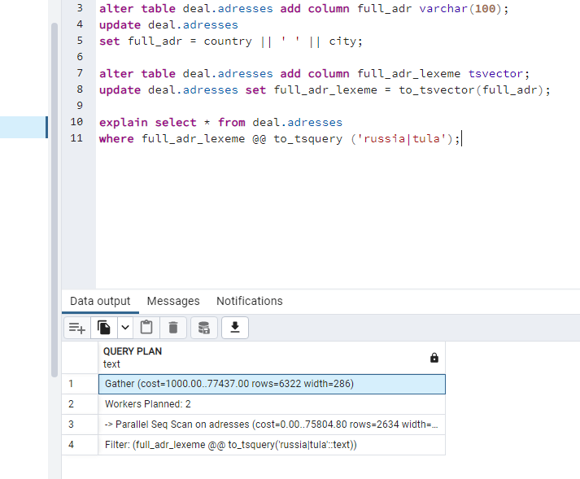

# Домашнее задание по лекции 11

## Индексы

1. Создать индекс к какой-либо из таблиц вашей БД. 
2. Прислать текстом результат команды explain, в которой используется данный индекс

Стоимость запроса до создания индекса.

На вторичный ключ в таблице deal.clientadress создаем индекс adr_ind, и снова считаем стоимость.
Индексы подхватились.

3. Реализовать индекс для полнотекстового поиска 

Для полнотекстового поиска создано поле full_adr_lexeme с типом tsvector, в котором есть город и улица из адреса, чтобы можно было искать клиентов по подходящему региону.
Сначала посмотрели на скорость работы селекта без индекса:

Создаем индекс на поле full_adr_lexeme. Скорость выполнения селекта в разы выше.

4. Реализовать индекс на часть таблицы или индекс на поле с функцией
Делаем выборку среди клиентов, имя которых начинается на e37.
Предположим, по первым трем буквам клиентов распределили для разных менеджеров.
Запрос без индекса:

Создаем индекс на функцию, которая отрезает первые три символа в имени клиента.
Запрос с индексом работает гораздо быстрее.

6. Создать индекс на несколько полей

Если есть частая необходимость искать клиентов по региону: страна, город, то обычный запрос отрабатывает долго.

Создаем индекс на 2 поля, и видим, что скорость выполнения запроса гораздо быстрее.

8. Написать комментарии к каждому из индексов. Описать что и как делали и с какими проблемами
столкнулись.

Индекс adr_ind создан на вторичный ключ, после чего запрос стал отрабатывать быстрее.

На небольшом кол-ве данных индексы не используются. Пришлось добавить очень много записей, чтобы они заработали.
Индекс автоматически создается по ограничению на уникальность. Обнаружила это опытным путем.:)

Основная сложность в наполнении таблиц данными.