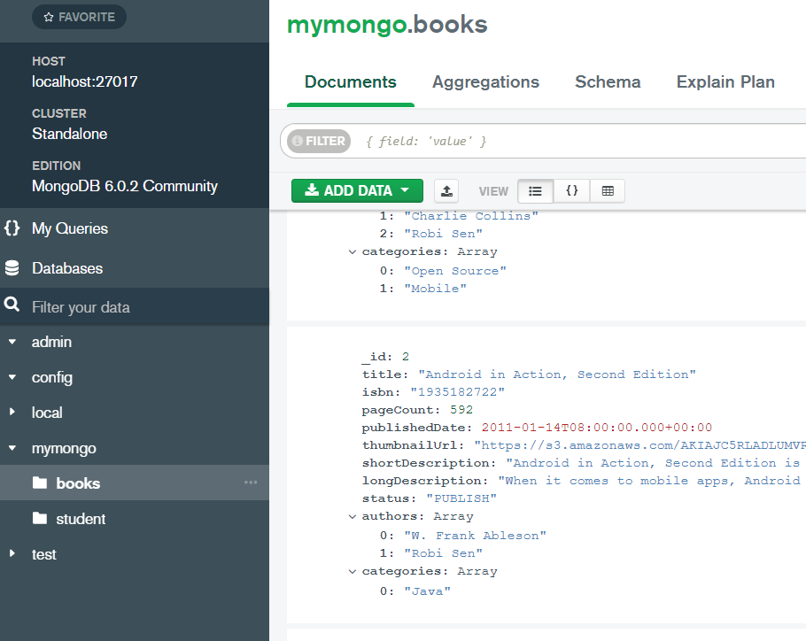
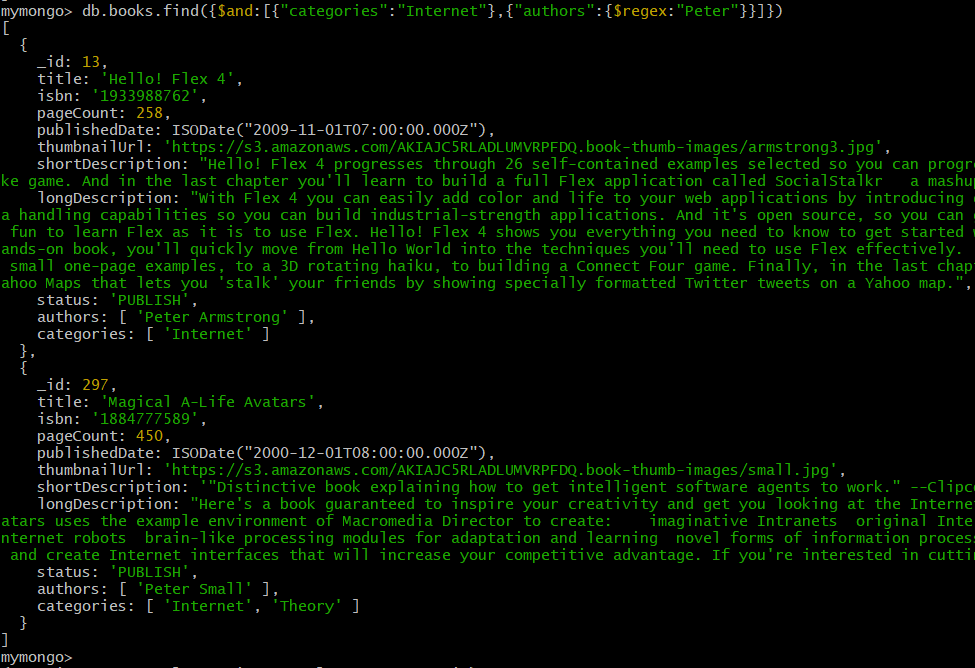
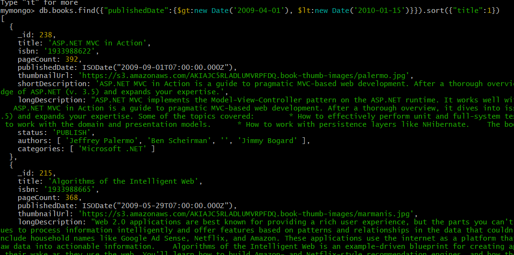
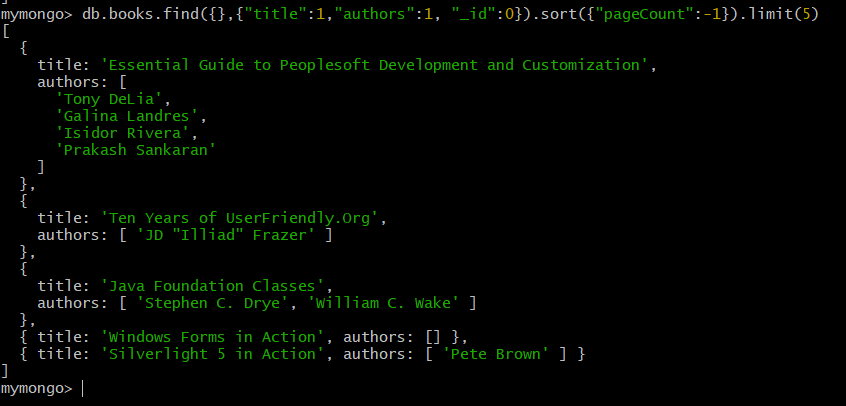

# Домашнее задание по лекции 39

## Mongodb

Установить MongoDB одним из способов: ВМ, докер;

заполнить данными;

написать несколько запросов на выборку и обновление данных

#### 1. Запрос по двум параметрам:

db.books.find({$and:[{"categories":"Internet"},{"authors":{$regex:"Peter"}}]})

##### ответ:

#### 2. Запрос: найти книги, попадающие в период по дате публикации и отсортированные по названию: 

db.books.find({"publishedDate":{$gt:new Date('2009-04-01'), $lt:new Date('2010-01-15')}}).sort({"title":1})

##### ответ:

#### 3. Вывести поля Название и Автор книг, которые отсортированы по кол-ву страниц от максимального к минимальному и выбраны первые 5:  

db.books.find({},{"title":1,"authors":1, "_id":0}).sort({"pageCount":-1}).limit(5)

##### ответ:

