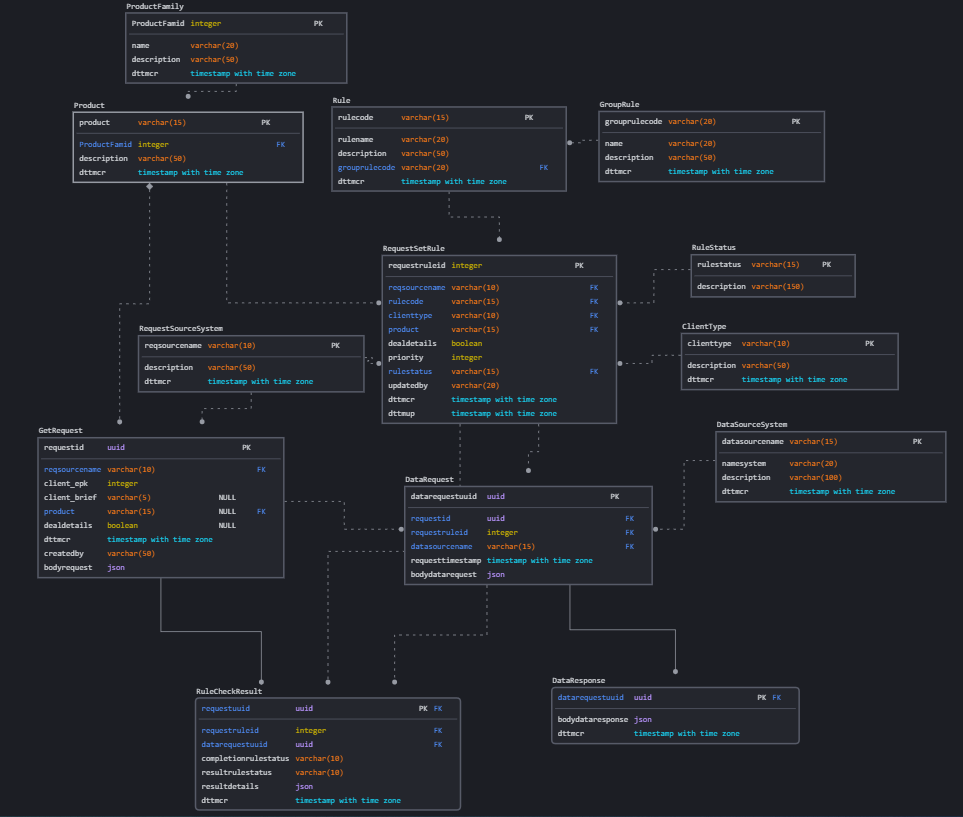

# Проект 

## Разработка и внедрение системы валидации клиентской сделки.

### Цели проекта:

Создать систему (сервер проверки), в которой пользователь сможет проверить правомерность заключения определенного вида сделки с клиентом.
Пользователь в приложении вводит все необходимые параметры и отправляет запрос на проверку.
Система выполняет следующие функции:

⦁	получает запрос от приложения с исходными данными. Данные запроса  сохраняются в БД;

⦁	в зависимости от полученных данных формирует и направляет  необходимые запросы в смежные системы с сохранением исходного запроса к каждой системе в БД;

⦁	получает и сохраняет в БД результаты ответов от смежных систем, объединяет результаты в один и направляет общий ответ в приложение.

⦁	запросы к БД могут быть только на просмотр того или иного запроса от пользователя или ответа от смежной системы.

⦁	планируется наращивать количество проверок, поэтому справочники БД будут расширяться.

Количество систем, от которых нужно получить ответ, на этапе MVP - около 5.

Выполнение запроса пользователя должно выполняться не более 1 сек.

### Что планировалось:

⦁	создать схему данных для проекта, учитывающую все виды проверок и требования к сохранению информации.

⦁	реализовать схему данных в БД

⦁	написать приложение, создать интеграцию приложения с сервером проверки

⦁	реализовать алгоритм на стороне сервера проверки с использованием БД

⦁	создание интеграции сервера проверки со смежными системами.

⦁	настройка DataSpace для репликации и бэкапа.

Используемые технологии:

DataSpace, PostgreSQL, язык разработки Java, вся интеграция через API

### Что получилось:

⦁	создать схему данных для проекта, учитывающую все виды проверок и требования к сохранению информации.

### Схемы:

Описание схемы данных:

Созданы таблицы-справочники для:

⦁ группы продуктов;
⦁ продуктов;
⦁ типов клиентов;
⦁ групп правил;
⦁ единичных правил;
⦁ внешних систем, откуда приходит запрос в сервер проверок;
⦁ смежных систем, куда выполняется запрос из сервера проверок.

Созданы таблицы, хранящие запросы, т.к. это есть в требованиях к системе:
⦁ getrequest - таблица хранит запрос, полученный от внешней системы, с выделением ключевых атрибутов, таких как Id клиента, продукт, указаны ли детали продукта. От данных атрибутов зависит выбор правила, которое необходимо запустить, создав запрос в смежную систему.
⦁ datarequest - таблица хранит запрос на смежную систему, после того, как по таблице правил было определено, что нужно сформировать этот запрос.
⦁ dataresponce - таблица ответов от смежных систем. Всегда один ответ на один запрос.

Отдельная таблица с правилами и условиями их применения: requestsetrule. С помощью таблицы определяется перечень правил в зависимости от заполненности атрибутов в исходном запросе.
Отдельная таблица с результатами проверок и их статусом завершения.

Все запросы хранятся в виде json.

### Выводы:
